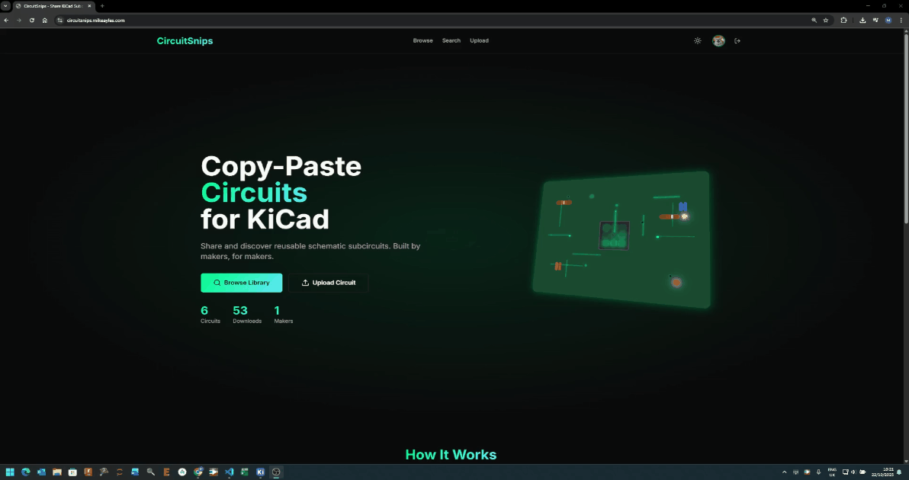

<div align="center">
  
</div>

# CircuitSnips

Share and discover reusable KiCad circuits.

[](https://opensource.org/licenses/MIT)

## What is this?

CircuitSnips lets you share schematic blocks - think voltage regulators, amplifiers, sensor interfaces - stuff you'd normally copy between your own projects. Now you can find what others have built and share what you've made.

Copy circuit in KiCad → Paste on CircuitSnips → Someone else searches → Copies to their project. That's it.

### Copy Flow



### Upload Flow


## Features

**Core Functionality**
- Interactive schematic preview using KiCanvas (WebGL viewer)
- Copy to clipboard with embedded attribution
- Download as .kicad_sch file
- GitHub OAuth authentication
- 8 open hardware licenses (CERN-OHL-S-2.0, MIT, Apache-2.0, GPL-3.0, etc.)

**Discovery & Search**
- Weighted full-text search (prioritizes tags > title > description)
- Search autocomplete with live preview
- Browse by popular tags/categories
- Filter by license, component count, quality score
- Sort by relevance, most copied, recent, or favorites

**Community Features**
- Threaded comments with up to 3 levels of replies
- Like/unlike comments
- Edit and delete your own comments
- Favorite circuits to save for later
- User profiles with bio, website, and avatar
- View count and copy count tracking

**Circuit Management**
- Upload circuits via paste or file
- Edit circuit metadata (title, description, tags, license, visibility)
- Delete your own circuits
- Private/public visibility toggle
- Automatic thumbnail generation (light and dark themes)

**Platform Features**
- Full light/dark mode support with theme-specific thumbnails
- Responsive design (mobile and desktop)
- Account deletion with full data removal
- Admin panel with thumbnail regeneration tools
- Batch import API for external circuit databases

## Roadmap

- Analytics dashboard (copy tracking, engagement metrics)
- Email notifications for comments and replies
- Circuit versioning and revision history
- "I Built This" section for user-submitted build photos
- Collections/playlists for organizing circuits
- Related/similar circuits recommendations

## Tech

Next.js 14, TypeScript, Tailwind, Supabase (PostgreSQL + auth + storage), KiCanvas for rendering. Hosted on Vercel.

## Running locally

```bash
git clone https://github.com/yourusername/circuitsnips.git
cd circuitsnips
npm install
cp .env.example .env.local
# Add your Supabase URL and keys to .env.local
npm run dev
```

Database setup: Create a Supabase project, then run `supabase/schema.sql` in the SQL editor. It's safe to run multiple times.

## Contributing

Fork it, make your changes, send a PR. Use conventional commits if you can.

Before committing:
- `npm run build` should pass
- `npm run lint` should pass

## Licenses

Platform code: MIT

Uploaded circuits: Users pick from CERN-OHL-S-2.0, MIT, CC-BY-4.0, CC-BY-SA-4.0, GPL-3.0, Apache-2.0, TAPR-OHL-1.0, or BSD-2-Clause

## Credits

- KiCad for existing
- KiCanvas for the WebGL viewer
- Everyone who shares their circuits

## Links

Live site: https://circuitsnips.com

Report bugs in GitHub Issues.

## Contact

Questions or feedback? Email us at info@circuitsnips.com
