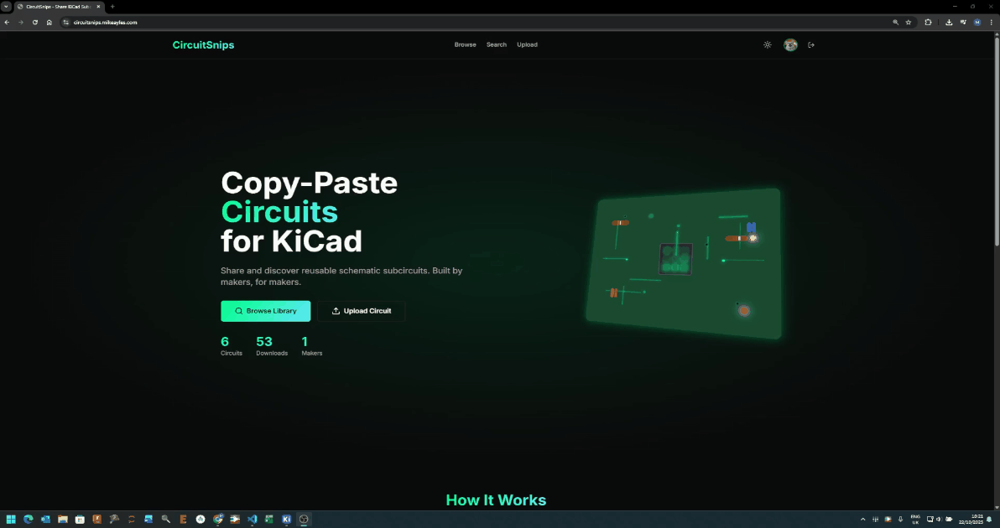

<div align="center">
  
</div>

# CircuitSnips

**Thingiverse, but for KiCad subcircuits.**

[](https://opensource.org/licenses/MIT)
[](https://circuitsnips.com)

## What is this?

CircuitSnips is a community-driven platform for sharing and discovering KiCad subcircuits. A place where engineers can share their proven circuit designs and help others avoid reinventing the wheel.

The comparison to Thingiverse is deliberate: this is for side projects and quick prototypes, not production designs. If you want to throw an ESP on a board with an AMS1117 and an MCP2515 for a weekend project, these circuits are a reasonable starting point. You should always check everything yourself, but if you're repeatedly throwing boards together with the same jellybean parts, why not have a library to pull from?

**Copy circuit in KiCad → Paste on CircuitSnips → Someone else searches → Copies to their project. That's it.**

### Copy Flow


### Upload Flow


## The Problem

As an electronics engineer, I found myself repeatedly designing the same common circuits - voltage regulators, protection circuits, signal conditioning stages, etc. While these patterns exist across thousands of projects, there wasn't a standardized way to share and reuse them within KiCad.

## Features

**Core Functionality**
- Interactive schematic preview using KiCanvas (WebGL viewer)
- Copy to clipboard with embedded attribution (author, source, license)
- Download as .kicad_sch file
- GitHub OAuth and email/password authentication
- 8 open hardware licenses (CERN-OHL-S-2.0, MIT, Apache-2.0, GPL-3.0, etc.)

**Discovery & Search**
- Weighted full-text search (prioritizes tags > title > description)
- Search autocomplete with live preview and thumbnails
- Browse by popular tags/categories
- Filter by license, category, and source type
- Sort by relevance, most copied, recent, or favorites
- Toggle to hide bulk-imported circuits

**Community Features**
- Threaded comments with up to 3 levels of replies
- Markdown support in comments and bios (with sanitization)
- Like/unlike comments
- Edit and delete your own comments
- Favorite circuits to save for later
- User profiles with bio, website, and avatar
- View count and copy count tracking
- Flag/report inappropriate circuits (no login required)

**Circuit Management**
- Multi-step upload wizard with live KiCanvas preview
- Edit circuit metadata (title, description, tags, license, visibility)
- Delete your own circuits
- Private/public visibility toggle
- Automatic thumbnail generation in light and dark themes
- Automatic paper size detection from bounding box

**Admin Tools**
- Batch import API for bootstrapping content from GitHub
- Thumbnail regeneration with versioning and optimistic locking
- Global stats sync
- User search and management
- Flag review and moderation

## Architecture

```
Next.js 14 (App Router)
├── Frontend: React 18, TypeScript, Tailwind CSS, shadcn/ui patterns
├── Backend: Next.js API routes (serverless on Vercel)
├── Database: Supabase (PostgreSQL with RLS, full-text search, RPC functions)
├── Storage: Cloudflare R2 (schematics + thumbnails, CDN-cached)
├── Viewer: KiCanvas (WebGL, loaded as custom element)
└── Auth: Supabase Auth (GitHub OAuth + email/password)
```

**Key Technical Details**

*S-Expression Processing*: KiCad uses S-expressions for both file storage and clipboard data. The parser handles snippet detection, wrapping snippets into valid .kicad_sch files, metadata extraction (components, nets, bounding box), paper size selection, and hierarchical sheet removal.

*Lazy R2 Cache*: The schematic API route acts as a write-through cache. If a circuit already has a processed schematic in R2, the route 302-redirects to the CDN URL (zero compute). On cache miss, it processes once, uploads to R2, updates the DB, and redirects. All 4,300+ circuits are pre-cached in R2.

*Search*: PostgreSQL full-text search with weighted tsvector ranking (tags > title > description), GIN indexes, and a server-side RPC function. Falls back to pattern matching if the RPC fails.

*Thumbnails*: Client-side capture from KiCanvas via native canvas export (with html2canvas fallback), uploaded to R2 with versioning and optimistic locking to prevent race conditions.

## Initial Data: The Bootstrapping Problem

A platform like this is useless without content, but nobody will contribute to an empty site. To break this chicken-and-egg problem, GitHub was scraped for kicad_sch files, classified by version and license, with attribution determined.

The kicad_sch S-expressions were flattened using a tokenizer, then fed into Gemini Flash 2.5 to extract and rank subcircuits. This gave us **4,300+ schematic files** with correct licenses and attribution, at an API cost of under £10.

The scraped collection includes circuits from automotive projects, medical devices, and hardware that's been to space. The classifier grades circuits on quality, which affects search ranking. There's a toggle to hide bulk uploads entirely from browse and search for users who prefer curated content only.

If users don't wish for their schematics to be included, there's a one-click report that doesn't require login.

## Running Locally

```bash
git clone https://github.com/MichaelAyles/kicad-library.git
cd kicad-library
npm install
cp .env.example .env.local
# Add your Supabase and R2 credentials to .env.local
npm run dev
```

**Database setup**: Create a Supabase project, then run `supabase/setup.sql` in the SQL editor. It's idempotent - safe to run multiple times. Configure GitHub OAuth in Authentication → Providers → GitHub.

**Environment variables**: See `.env.example` for required Supabase URL/keys and Cloudflare R2 credentials.

## Development

```bash
npm run dev          # Start dev server (localhost:3000)
npm run build        # Production build (includes type checking + linting)
npm run lint         # ESLint
npm run import       # Run batch import script
npm run import:test  # Test import (10 circuits, dry-run)
```

Before committing:
- `npm run build` must pass
- `npm run lint` must pass
- Use conventional commits (`feat:`, `fix:`, `docs:`, `refactor:`, etc.)

## Roadmap

- KiCad plugin integration
- Automated testing (unit + E2E)
- CI/CD pipeline
- Support for other EDA tools
- Email notifications for comments and replies
- Circuit versioning and revision history
- "I Built This" section for user-submitted build photos
- Collections/playlists for organizing circuits
- Public API for third-party integrations

## Contributing

Fork it, make your changes, send a PR. Use conventional commits if you can.

## Licenses

**Platform code**: MIT

**Uploaded circuits**: Users pick from CERN-OHL-S-2.0, MIT, CC-BY-4.0, CC-BY-SA-4.0, GPL-3.0, Apache-2.0, TAPR-OHL-1.0, or BSD-2-Clause

## Credits

- [KiCad](https://www.kicad.org/) for existing
- [KiCanvas](https://github.com/theacodes/kicanvas) for the WebGL viewer
- Everyone who shares their circuits

## Links

- **Live site**: https://circuitsnips.com
- **Blog post**: [Building CircuitSnips](https://www.mikeayles.com/#circuitsnips-com)
- **Report bugs**: [GitHub Issues](https://github.com/MichaelAyles/kicad-library/issues)

## Contact

Questions or feedback? Open an issue or reach out at info@circuitsnips.com
